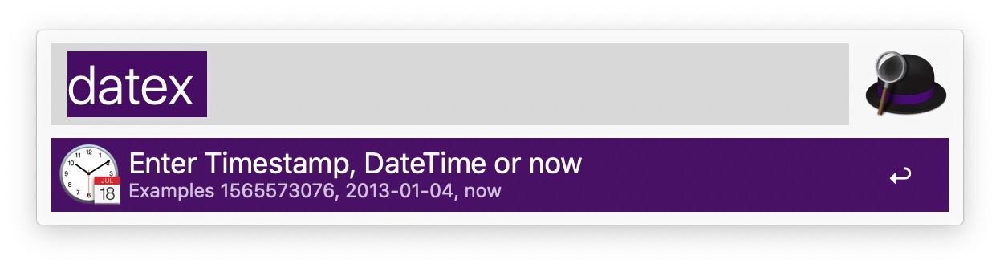
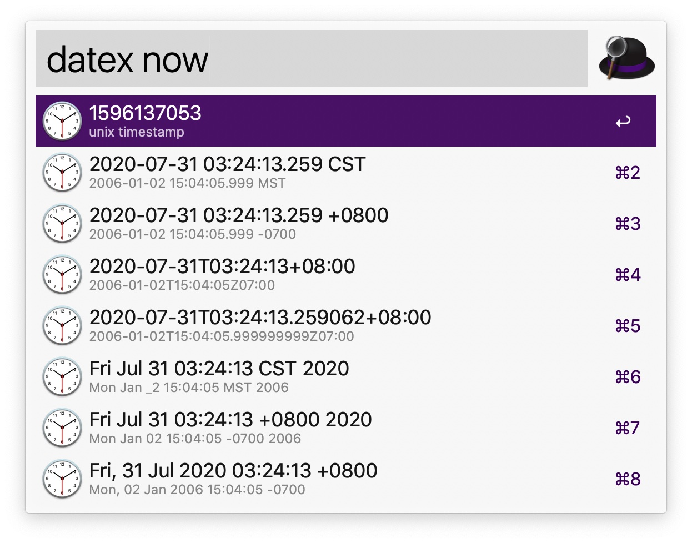
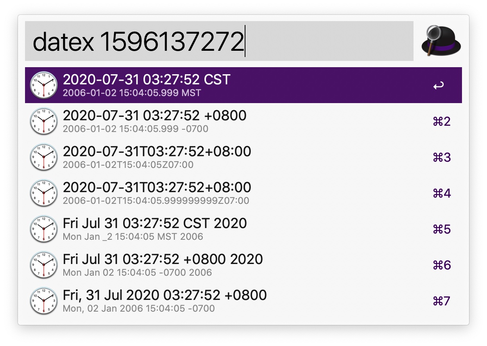
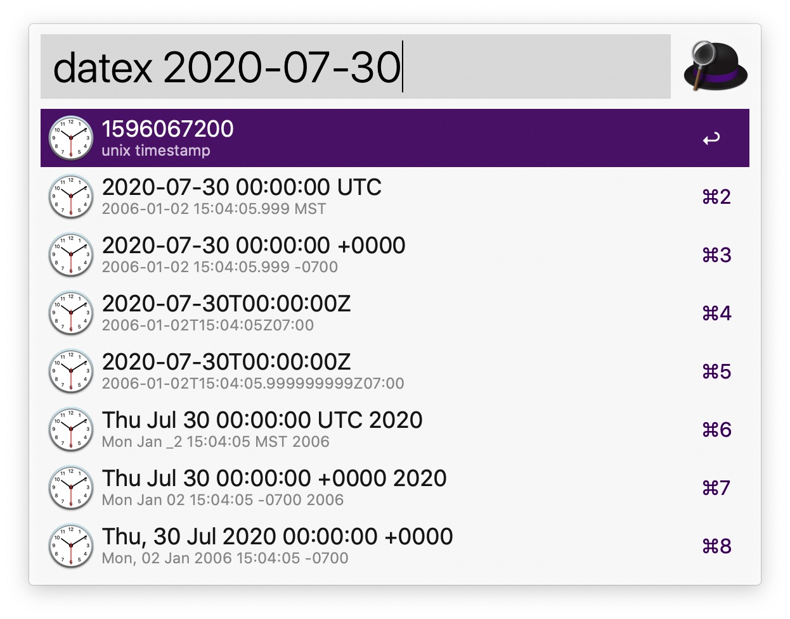

# alfred-datetime-workflow

该workflow主要是为了方便地完成 "时间戳" && "格式化日期+时间字符串" 之间的转换，方便使用。

开发人员，经常会涉及到时间相关的转换操作，我就经常有这样的需求，有个趁手的工具还是很有必要的。

我使用alfred workflow来实现时间转换，alfred workflow和alfred本身的交互是通过管道方式进行连接的：
- alfred将用户输入的信息转发给匹配的workflow；
- workflow对接收到的参数进行处理，并将处理的结果按照指定格式输出到stdout；
- alfred读取stdout中的数据作为响应展示到用户界面；

这里的交互过程，让我想起了protoc及其插件之间的交互，交互方式类似。

这里呢，我主要使用了awgo来编写workflow，实现逻辑可以参考下代码，逻辑很简单。下面主要介绍下如何使用。

# 如何安装？
直接下载本项目下workflow目录中的文件 `Date Formats Go.alfredworkflow`，双击即可安装到alfred中。

# 如何使用？

1. 运行 `datex` 换起workflow  

2. 常用转换操作，获取当前时间对应的Unix时间戳，以及格式化字符串  
运行命令`datex now`即可，此时会转换输出对应的时间戳以及格式化后的字符串，有多种日期格式。  
您可以用上下键移动进行选择，当您按下回车键时，会将对应的结果拷贝到剪贴板，方便粘贴使用。

3. 常用转换操作，将时间戳转换为对应的格式化字符串  
以时间戳1596137272为例，运行命令`datex 1596137272`，此时会将时间戳转换为格式化后的字符串。  
选择、复制数据操作类似。

4. 常用转换操作，将格式化字符串转换为时间戳，或其他格式  
以字符串`2020-07-30`为例，运行命令`datex 2020-07-30`，此时会先将其与候选的格式化字符串进行匹配。  
并转换成一个有效的时间戳。  然后再根据此时间戳，转换为其他格式对应的字符串。选择、复制数据操作类似。

就是该workflow的使用方式，这个workflow也是我使用awgo编写的第一个workflow。

关于日期时间格式转换的workflow，github上已经有几个比较好的实现了，这里无意重复造轮子。  
主要是考虑到：
- 个别实现对timezone支持不好，
- 或者采用的时间格式不符合国人习惯。
- 另外，我也想学习下awgo来开发alfred workflow

本身我比较喜欢golang，也熟悉golang，掌握另外awgo之后我可以编写更多好用的效率工具。

希望这个小工具能够帮助到大家。

# 联系我

有建议或者问题，可以给我发邮件：hit.zhangjie@gmail.com。